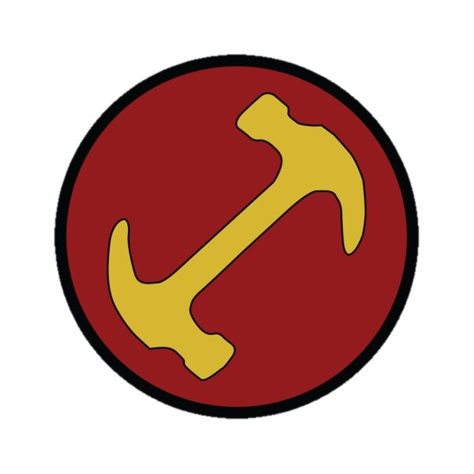

<table>
  <tr >
    <td align="left">
      
    </td>
    <td>
      <h1>Stonecutters</h1>
    </td>
  </tr>
</table>

# 🎯 Objetivo del Repositorio

Este repositorio representa nuestro camino hacia la excelencia en Cloud, donde documentamos nuestro aprendizaje práctico y evolución en tecnologías cloud de Microsoft Azure.
 

##Nuestra Misión
🎓 Dominar los conceptos de AZ-104 (Azure Administrator) y AZ-400 (Azure DevOps Engineer)

⚡ Adquirir habilidades prácticas mediante laboratorios hands-on

🔧 Automatizar infraestructura con Terraform

🔄 Implementar pipelines CI/CD con Azure DevOps y GitHub

☁️ Convertirnos en expertos en tecnologías Cloud
 

## 🛠️ Tecnologías en Foco
| Área | Tecnologías |
|------|-------------|
| **Infraestructura** | Azure Resource Manager, Terraform, Azure CLI |
| **Administración** | AZ-104 Concepts, Monitoring, Security, Networking |
| **DevOps** | AZ-400, Azure Pipelines, GitHub Actions, CI/CD |
| **Contenedores** | Azure Kubernetes Service, Docker |
| **Seguridad** | Azure Security Center, Identity Management |
 

## 📚 Metodología de Aprendizaje
Aprendizaje Práctico
✅ Laboratorios hands-on con escenarios reales

✅ Documentación de procesos y mejores prácticas

✅ Repetición hasta alcanzar maestría

✅ Colaboración y code review entre compañeros
 

## Enfoque por Etapas
1. Fundamentos - Conceptos básicos y laboratorios guiados
2. Profundización - Escenarios complejos y troubleshooting
3. Maestría - Diseño de arquitecturas y optimización
 

## 🎖️ Nuestro Compromiso
"La maestría no llega por accidente, sino por la práctica deliberada y consistente. Cada laboratorio, cada error, cada éxito nos acerca a la excelencia en Cloud."